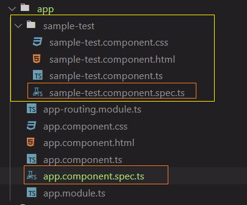

# Angular Testing

## Table of Contents  
1. [Automated Testing](#Automated-Testing)<br>
2. [Types of Tests](#Types-of-Tests)<br>
3. [Angular Testing Tools](#Angular-Testing-Tools)<br>
4. [Test File and Code](#Test-File-and-Code)<br>
5. [Suits and its functions](#Suits-and-its-functions)<br>
6. [Expectations and Matchers](#Expectations-and-Matchers)<br>
7. [Accessing Component in Spec Block](#Accessing-Component-in-Spec-Block)<br>

## Automated Testing

1. Catching the defects before software release
2. Identify the design mistakesjay
3. Helps in regression testing
4. Acts as a documentation of app functionality
5. Should not be used when " Limited time, limited budget, unsure product future"
6. Should not use if frequent changing in requirements

## Types of Tests

1. **unit test**
   1. Test component in isolation, without external resources like DB, files, etc
   2. Test functionality of individual unit and not the entire app
   3. Least confidence on correct implementation of the app
2. **Integration testing**
   1. Test the component with external resources
   2. Better confidence then Unit testing
3. **End-to-End Testing**
   1. Test the entire app as a whole
   2. Most confidence over the app functionality
   3. Slow and fragile 
4. **Ideal Scenario**
   1. Developer implements the  unit tests, other tests are conducted by the QA department
   2. Spend more time to write unit test and integration tests
   3. Write few end-to-end tests for only the key functionality
5. Apply same principles as the functional testing
6. Follow Single responsibility principle, test only one thing at a time

## Angular Testing Tools

1. **Jasmine**
   1.  It is a behavior-driven development framework for unit testing the javascript code
   2. Dependency free and does not require a DOM
2. **Karma**
   1. It is a test runner for writing and running the unit tests while developing an Angular app
   2. Since browser do not have natively a concept of loading the test files, running them and reporting results, We will need karma
   3. Karma roughly perform following thing to test the app in browser environment
      1. Starting small web browser, to serve the app
      2. Load the test files which are related to the app
      3. Serve a custom web page that will run JS code for the test
      4. Load the webpage of the app
      5. Report the results of the test to the above created server
      6. Also report the results to the text files, the consoles etc
   4. Karma looks into the files in app directory which has extension of ```spec.ts``` which are basically a test file
3. **Protractor**
   1. Write and run e2e tests
   2. Explore the app as users experience it
4. **Angular Testing Utilities**
   1. Create a test environment for the application code under test
   2. Used to test interactions between components

## Test File and Code

1. Each angular app component has its own test file, which is being used to write the test code of that particular component [ represent in orange rectangle ]

2. The test file per component is created by the angular CLI, while creating the component. It should have extension of ```.spec.ts```

   

3. To run the test from angular CLI, execute the command ```ng test``` from the project directory

4. Upon ```ng test``` command execution, karma test runner, scan all the component for ```spec.ts``` files, and execute them after creating all the testing environment

## Suits and its functions

1. What is Suites?

   1. A suite groups a set of specs or test cases, it created using Jasmine global function ```describe()```

   2. ```describe()``` function takes two parameters, the title of the test suite and the function that implements the actual code of the test suite 

   3. ```app.component.spec.ts```

      ~~~typescript
      describe('AppComponent', () => {
        // the specs will come here
      });
      ~~~

   4. Best practice: The name of suite should be same as name of the component. In above case it is ```AppComponent```

2. What is ```it()``` ?

   1. Specs are defined by calling the global jasmine function ```it()```, which is like ```describe()``` function takes a string and a function
   2. The string is a title of the spec and the function is spec
   3. The spec function can contain one or more expectations ```expect()```, which test the state of the code 
   4. A spec with all true expectations is a passing spec
   5. A spec with one or more false expectations is a failing spec
   6. ```it()``` blocks are functions, they can contain any executable code necessary to implement the test. 
   7. The JavaScript scope rules applies here, so variable declared in a ```describe()``` are available to all the ```it()``` block inside suite. ```component``` is the property declared on ```describe()``` level and accessed on ```it()``` level

   ~~~typescript
   describe('AppComponent', () => {
     let component: AppComponent;
   
     //--------------------- SPEC START-------------------------------------------  
     // it block with two parameters
     // param1 : name of the spec [should create]
     // param2 : an arrow function  
     it('should create', () => {
       expect(component).toBeTruthy();		// check next section
     });
     //----------------------SPEC END----------------------------------------------  
   
   });
   ~~~

3. For expectation and matchers, check the next section

## Expectations and Matchers

1. What are ```expectations```

   1. Expect function basically take the result obtain from the execution of the function which is under test
   2. Except function must always be chained by the matcher function

2. What are ```matchers```

   1. Each matcher implements a boolean comparison between actual value obtained by executing the function under test and expected value

   2. Matcher function takes the expectation value as a parameters, If a value obtained from function under test is satisfying the matcher function and its parameter then test is successful, else test will fail

   3. Any matcher can evaluate to a negative assertion by chaining the ```not``` function before the matcher function

      1. Chaining the not method example : ```expect(app).not.toBeTruthy();```

   4. available built-in matcher functions
   
      | Matcher Functions                           | Description                                                  |
      | ------------------------------------------- | ------------------------------------------------------------ |
      | ```toBe(TRUE)```                            | Check boolean outcome                                        |
      | ```toEqual(VALUE)```                        | Check the equality                                           |
      | ```toMatch(STRING)```                       | matches the strings                                          |
      | ```toBeDefined()```                         | check whether object is defined                              |
      | ```toBeUndefined()```                       | check whether object is undefined                            |
      | ```toBeNull()```                            | check whether object is null                                 |
      | ```toBeTruthy()```                          | Evaluate the value to be true in boolean context             |
      | ```toBeFalsy()```                           | Evaluate the value to be false in boolean context            |
      | ```toContain(STRING)```                     | Check whether mentioned string contains in the property/function under test |
      | ```toBeGreaterThan(NUMBER)```               | Check whether obtained number is greater then the mentioned number |
      | ```toBeLessThan(NUMBER)```                  | Check whether obtained number is smaller then the mentioned number |
   | ```toBeCloseTo(NUMBER,DECIMAL_PRECISION)``` | It allows you to check if a number is close to another number, given a certain amount of decimal precision as the second argument. |
      | ```toThrow()```                             | Check whether function under test thrown an error            |

   5. **Truthy** value is a value that is considered `true` when encountered in a Boolean context. All values are truthy unless they are defined as falsy (except for `false`, `0`, `-0`, `0n`, `""`, `null`, `undefined`, and `NaN`).

   6. Sample expect and matcher function inside ```it()``` spec block
   
      ~~~typescript
      // this spec block will check whether component created or not ?
      // if component created then this test is successful, else test is failed
      it('should create the app', () => {
        let fixture = TestBed.createComponent(SampleTestComponent);
        let app = fixture.debugElement.componentInstance;
        expect(app).toBeTruthy();
   });
      ~~~
   
   7. Check next section for detail about accessing the component in test spec

## Declaring, the component under test

1. Before each ```it()``` get executed, we need to declare the component which is under test

2. Just like angular life cycle hooks, each test suite has its own life cycle hooks

3. For example, beforeEach, beforeAll, afterEach, afterAll [setup and teardown methods]

4. In the setup section, the component under test is declared as follow

   ~~~typescript
   beforeEach(() => {
     TestBed.configureTestingModule({
        declarations:[SampleTestComponent]
     });
   });
   
   // TestBed is the part of angular testing utility
   ~~~

## Test Setup and Teardown methods

1. Just like angular life cycle hooks, we can access different stages of test 

2. By accessing you can execute your code prior to the test

3. Along with setup code before test, we can execute the certain code on test ending by utilizing certain methods provided by Angular test utility

4. ```beforeEach( ()=> {} )``` 

   1. This function takes an arrow function as its parameter

   2. As name suggests, this function will be called and arrow function which it holds will be executed, before each ```it()``` specs

   3. Template:

      ~~~typescript
        beforeEach(() => {
      	// the code here will be executed 
          // every time when beforeEach is called
        });
      ~~~

5. ```afterEach(() =>{})```

   1. Opposite to the ```beforeEach()```, ```afterEach()``` will be called after execution of each ```it()``` spec

   2. Same as beforeEach function, afterEach also takes an arrow function as its function parameter

   3. And the code written inside arrow function will be executed whenever ```afterEach()``` is called

   4. Template: 

      ~~~typescript
        afterEach(() => {
      	// the code here will be executed 
          // every time when beforeEach is called
        });
      ~~~

6. ```beforeAll(() => {})```

   1. Unlike above mentioned test hooks, this one will be called once in the  beginning of the test, and not every time when spec is being executed
   2. This function also takes an arrow function as a parameter

7. ```afterAll(() => {})```

   1. This function also takes an arrow function as a parameter 
   2. ```afterAll()``` will be called once all the specs are conducted

## TestBed

1. The `TestBed` class is one of the principal Angular testing utilities

2. It creates the angular testing module

3. It has multiple methods which are used to create and access the component under test

4. It also configure the module which need to be tested

5. The configuration of component under test can be done in the setup test hook as follow

   ~~~typescript
   beforeAll(() => {
     TestBed.configureTestingModule({
        declarations:[SampleTestComponent]
     });
   });
   ~~~

6. Testbed class can be used to create the component instance in the spec as follow

   ~~~typescript
   let fixture = TestBed.createComponent(SampleTestComponent);
   // fixture will hold the instance of the SampleTestComponent
   // we can access this component using fixture
   ~~~

7. TestBed class has many more methods, but this two methods are used very frequently, for other method follow the [link](https://angular.io/guide/testing-utility-apis)

## Accessing Component in Spec Block using angular testing utility

1. In this section we will access the different property of the component under test 

2. Create the instance of the component in ```it()``` spec as  follow

   ~~~typescript
     it('should create the app', () => {
       let fixture = TestBed.createComponent(SampleTestComponent);
     });
   ~~~

3. Obtain the component instance as follow

   ~~~typescript
     it('should create the app', () => {
       let fixture = TestBed.createComponent(SampleTestComponent);
       let app = fixture.debugElement.componentInstance;
     });
   ~~~

   

## Accessing the template using angular testing utility